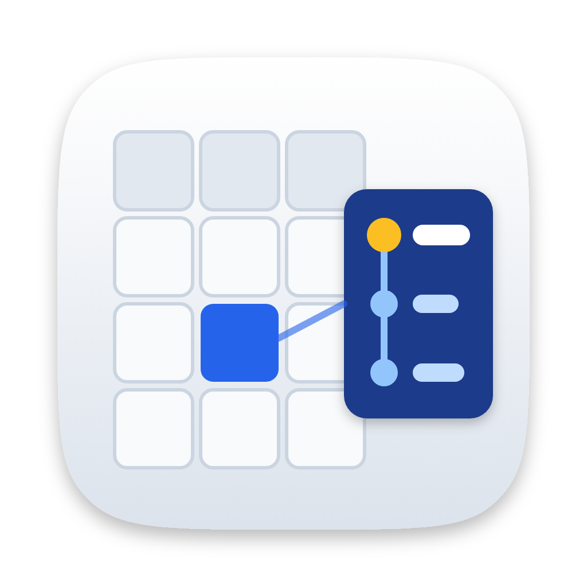

# Bigtable Desktop

A desktop app for **reading and exploring Google Cloud Bigtable data**. It is built with Electron and the official [`@google-cloud/bigtable`](https://www.npmjs.com/package/@google-cloud/bigtable) Node.js client. It is meant for using Bigtable, not administering it: it lists projects, instances, clusters and tables, but it never creates, changes or deletes anything.

## Features

- **Projects, instances, clusters, tables**
  - Discover every project your credentials can see (Cloud Resource Manager), or add one by ID.
  - Expand a project to list its instances. Expand an instance to see its clusters (location, node count, storage type) and its tables.
  - If your IAM roles let you read data but not list resources, add an instance or table by ID.
  - Works with the Bigtable emulator: when you add a project, set an emulator host.
- **Query tabs**
  - Each table opens in its own tab, and you can keep as many tabs open as you like.
  - Every tab keeps its own query. Tabs, queries and settings are saved and restored the next time you open the app.
  - **Rows mode** reads rows by key prefix, key range or a list of exact keys. You can filter by column family, qualifier regex, value regex and write-time range, and set versions per cell and a row limit. *Load more* pages through large scans.
  - **SQL mode** runs [GoogleSQL for Bigtable](https://cloud.google.com/bigtable/docs/googlesql-overview). Column-family maps are expanded into `family:qualifier` columns. Queries using `with_history => TRUE` show full version timestamps.
- **Cells and JSON**
  - The results grid groups columns by family. JSON cells are marked `{ }` and cells with older versions show a ↺ count.
  - The inspector shows JSON pretty-printed with highlighting, as a collapsible tree, as raw text, or as a hex dump. 8-byte counters are also decoded as int64.
  - Click a row key to see the whole row.
- **Versions with readable timestamps**
  - Every version appears on a timeline showing the time (`14:32:05.123 PDT`), the date (`Tue, Oct 6, 2026`), how long ago it was written ("3 minutes ago"), and the gap to the previous version ("1d 2h after previous").
  - Hover a version for the exact ISO-8601 time to the microsecond. Switch between local time and UTC at the bottom of the sidebar.
  - *Diff vs previous* compares a version line by line with the one before it.
  - *Load full history* fetches every stored version of a cell.
- **Export**
  - Export results as JSON (all versions with timestamps, or latest values only), NDJSON, or CSV (latest values, optionally with timestamps), or copy them to the clipboard.
  - Export a single cell with its full history, or a whole row.
  - *Copy MCP reference* copies a short reference to the query and the results you're looking at, to paste into Claude Code.
- **Built-in MCP server** gives Claude Code (or any MCP client) read-only access to the same data. See [Use with Claude Code](#use-with-claude-code).

## Install with Homebrew (macOS)

This repository is also a Homebrew tap:

```sh
brew tap eveenendaal/bigtable-desktop https://github.com/eveenendaal/bigtable-desktop
brew install --cask bigtable-desktop
```

The cask installs the DMG from the latest GitHub release. The app is ad-hoc signed but not notarized, so the cask removes the quarantine flag after installing.

`brew upgrade` quits Bigtable Desktop if it is running and reopens it once the new version is installed.

## Use with Claude Code

Bigtable Desktop includes an MCP server, so Claude Code can query Bigtable with the same credentials, projects and saved queries as the app. It is read-only, and it runs inside the app on `http://localhost:8487/mcp` for as long as the app is open.

**From the app (easiest):** choose **File → Connect to Claude Code…** (or the plug button above the project list), then click **Add to Claude Code**. This runs `claude mcp add` for you at user scope, so the server is available in every project. The dialog also shows the command to run yourself, a JSON configuration for other MCP clients, and lets you change the port if 8487 is taken.

**From a terminal:**

```sh
claude mcp add --transport http --scope user bigtable-desktop http://localhost:8487/mcp
```

The server only accepts connections from this computer, and refuses requests from web pages.

Then run `/mcp` in Claude Code to check the connection, or just ask about your data.

| Tool | What it does |
| --- | --- |
| `list_projects` | Projects configured in the app (with known instances and tables); `discover: true` also lists every project you can see |
| `list_instances`, `list_clusters`, `list_tables`, `list_column_families` | Discovery |
| `read_rows` | Rows by prefix, range or exact keys, with family, qualifier, value and time filters; pages with `start_after` |
| `read_cell_history` | Every version of one cell, newest first |
| `execute_sql` | GoogleSQL for Bigtable |
| `list_saved_queries`, `run_saved_query` | The query tabs open in the app |
| `get_query_results` | The results you were looking at when you used *Copy MCP reference* |

JSON values come back parsed, and every version has an ISO-8601 timestamp with microsecond precision.

**Point Claude at a query:** in a query tab, choose **Export → Copy MCP reference** and paste it into Claude Code. The app saves a snapshot of the rows on screen, including pages loaded with *Load more* and any full history you loaded. The reference tells Claude how to fetch that snapshot and how to re-run the query:

```
Bigtable Desktop query "users" (via the bigtable-desktop MCP server):
- Results I'm looking at: get_query_results {"id":"tab-muwd2ygr-0"} (60 rows, captured 2026-10-06T07:32:52.179Z)
- Re-run it: run_saved_query {"id":"tab-muwd2ygr-0"}
- Table: demo-project@localhost:8086 / demo-instance / users
- Query: prefix "user#00" · 5 versions per cell · limit 100
```

## Authentication

The app uses [Application Default Credentials](https://cloud.google.com/docs/authentication/application-default-credentials):

```sh
gcloud auth application-default login
```

Recommended roles:

| Role | Lets you |
| --- | --- |
| `roles/bigtable.reader` | Read rows, list tables and column families |
| `roles/bigtable.viewer` | List instances and clusters |
| `roles/browser` | Discover projects |

## Keyboard shortcuts

| Action | macOS | Windows / Linux |
| --- | --- | --- |
| Run query | ⌘↵ | Ctrl+Enter |
| Cancel query | ⌘. | Ctrl+. |
| New / duplicate / close tab | ⌘T / ⇧⌘D / ⌘W | Ctrl+T / Ctrl+Shift+D / Ctrl+W |
| Reopen closed tab | ⇧⌘T | Ctrl+Shift+T |
| Next / previous tab | ⌥⌘→ / ⌥⌘← | Ctrl+Alt+→ / Ctrl+Alt+← |
| Export results | ⌘E | Ctrl+E |
| Toggle sidebar | ⌘B | Ctrl+B |
| Toggle UTC / local time | ⇧⌘U | Ctrl+Shift+U |

Arrow keys move between cells in the results grid. Option-click (Alt-click) a table to open it in a new tab.

## Development

The Makefile wraps the common tasks; run `make` to list them:

```sh
make start          # install dependencies if needed and run the app
make test           # unit tests
make test-emulator  # all tests, starting a local Bigtable emulator if none is running
make demo           # emulator + sample data + app
make install-mac    # build for this Mac and copy it to /Applications
```

The emulator targets use `cbtemulator` from `gcloud components install bigtable` if it is installed. Otherwise they install the emulator with `go install`.

Or use npm directly:

```sh
npm install
npm start
```

To try the app against the local Bigtable emulator with sample JSON data:

```sh
gcloud beta emulators bigtable start --host-port=localhost:8086 &
npm run seed:emulator
npm start
# In the app: add project "demo-project" with emulator host localhost:8086,
# then add instance "demo-instance" (the emulator cannot list instances).
```

The emulator does not support listing instances or clusters, or GoogleSQL. Everything else works against it.

Tests use the built-in Node.js test runner. The emulator integration tests run when `BIGTABLE_EMULATOR_HOST` is set:

```sh
npm test
BIGTABLE_EMULATOR_HOST=localhost:8086 npm test
```

### Project layout

```
src/main/       Electron main process: window, menu, IPC, Bigtable client wrapper, persistence
src/preload/    contextBridge API exposed to the renderer
src/renderer/   UI (plain ES modules, no build step)
src/shared/     Code used by both processes: byte handling, JSON detection, timestamps, diff, export
Casks/          Homebrew cask (this repo is a tap)
scripts/        Emulator seeding, cask updating
```

The workspace is saved to `workspace.json` in the app's user-data directory (`~/Library/Application Support/Bigtable Desktop` on macOS).

## Releasing

1. Start a release in one of two ways:
   - push a version tag:

     ```sh
     git tag v0.2.0
     git push origin v0.2.0
     ```

   - or bump `version` in `package.json`, then run the **Release** workflow manually from the Actions tab. It creates the `v<version>` tag itself.

2. The **Release** workflow then:
   - builds the macOS installers (arm64 and x64 DMG/ZIP). Linux and Windows builds are commented out in the workflow for now;
   - publishes them to a GitHub release;
   - commits the new version and SHA-256 checksums to `Casks/bigtable-desktop.rb` on the default branch.

`brew install --cask bigtable-desktop` will work once that first release has been published.
